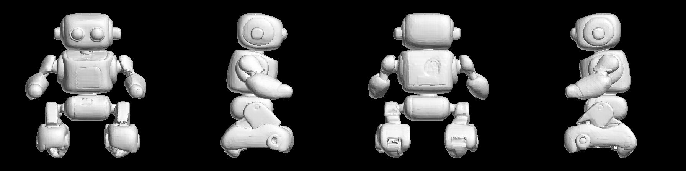
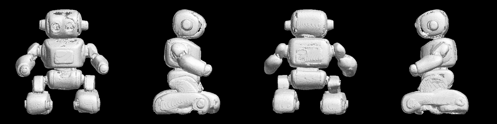
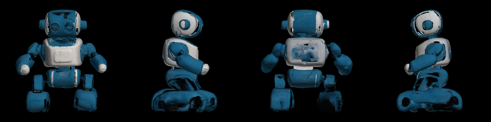

# trellis-strix-halo

[](https://github.com/kroqueta-s/trellis-strix-halo/actions/workflows/test.yml)

**[TRELLIS](https://github.com/microsoft/TRELLIS) image-to-mesh on AMD Strix Halo
(gfx1151), Windows, ROCm — with no CUDA-only package installed.**

Upstream TRELLIS needs `spconv`, `flash-attn` or `xformers`, `kaolin` and
`nvdiffrast`. None of those exist for Windows + ROCm. This repository supplies
pure-torch replacements that are injected at launch time, so **upstream code is
cloned and run unmodified**.

The runner speaks one JSON object per line over stdin/stdout, so any
orchestrator can drive it as a child process —
[hearth](https://github.com/kroqueta-s/hearth) is one, built to hold this
runner and its siblings behind a single interface, one loaded at a time. It
also runs standalone (see Quickstart).

**There is a second runner here, for
[TRELLIS.2](https://github.com/microsoft/TRELLIS.2)** (`runners/trellis2/`, in
its own virtual environment). It reaches far more detail - millions of faces
rather than hundreds of thousands - and upstream needs six CUDA-only packages
to do it, none of which is compiled here either. It carries colour two ways,
on the vertices and in a UV texture with its metallic, roughness and alpha
channels, and what it writes for printing is a **solid carved out of the
surface** rather than the surface sewn shut - watertight, one part, and sliced
in Bambu Studio with no repair and no warnings. What it costs, what it cannot
do, and the traps it took to get there are in
[`docs/trellis2.md`](docs/trellis2.md).

*The bundled [`assets/sample.png`](assets/sample.png) (an SDXL-generated robot)
is the reference specimen for everything below. These are what the two runners
made of it - front, right, back and left, standing as the image does - drawn by
[`tools/render_mesh.py`](tools/render_mesh.py) with no external renderer.
**Which way a mesh faces is not knowable from the mesh**, which is why the
runner reports `forward_axis: null` and why these were turned by hand
(`--rotx -90 --yaw 0 --pitch 0`).*

| Input |
|---|
|  |

**TRELLIS.1** — 517,498 faces, no colour: texture baking needs `nvdiffrast`.



**TRELLIS.2 at 1024** — 1,496,458 faces, a solid carved out of the surface:
watertight, one part, and what gets printed.



**TRELLIS.2's texture** — a second, coarser mesh (200,000 faces) carrying a
2048² UV map with its metallic, roughness and alpha channels. Sampled per
pixel here rather than per vertex, which is the only way to see a seam.



## Prerequisites

- Windows 11
- Git
- An AMD GPU supported by ROCm on Windows (verified on **Strix Halo / gfx1151**,
  Radeon 8060S)
- A current AMD Adrenalin driver (verified with the 2026-08 driver; the
  **ROCm 10.0 runtime itself ships inside the wheels** that install.ps1 pins)
- **Python 3.12**
- ~10 GB of disk (venv + upstream clone + 3.1 GB of weights)
- ~16 GB of free VRAM at peak

## Install

```powershell
git clone https://github.com/kroqueta-s/trellis-strix-halo
cd trellis-strix-halo
.\install.ps1
```

That creates a virtual environment, installs ROCm PyTorch, clones upstream at a
pinned commit, downloads the weights (3.1 GB), writes `.env`, and **verifies the
replacements against exact references** before you trust any mesh. If PowerShell
refuses to run the script, use
`powershell -ExecutionPolicy Bypass -File .\install.ps1`.

## Quickstart

Generate a mesh from the bundled sample, no JSON required:

```powershell
.venv\Scripts\python.exe tools\run_single.py --image assets\sample.png --out C:\out
```

The mesh lands in `C:\out\raw.ply`. Progress streams to the console, with a bar
for every stage whose steps can be counted:

```
[   32.1s] structure  [############------------]  50%  (12/25)
[   58.4s] slat       [######------------------]  25%  (6/25)
```

**The percentage is counted, never estimated**, and there is no ETA on purpose:
on this hardware the first run of a loop can be an order of magnitude slower
than every run after it, so a prediction would mislead exactly when it mattered.
Stages whose length is not known report a step number and nothing more.

To reproduce the benchmark below, run the same command **twice and time the
second run**: the first run includes MIOpen's one-time convolution tuning, which
says nothing about steady-state speed.

## Use

```powershell
.venv\Scripts\python.exe -m runners.trellis
```

Then write one request per line:

```json
{"id": 1, "method": "capabilities"}
{"id": 2, "method": "image_to_mesh", "params": {"image_path": "C:/in.png", "out_dir": "C:/out"}}
```

`capabilities` answers without loading weights. `image_to_mesh` writes `raw.ply`
and returns vertex/face counts plus timings. Parameters: `ss_steps`,
`slat_steps`, `ss_guidance`, `slat_guidance`, `seed`.

## What is replaced, and why it is safe

| Upstream dependency | Replacement | Verified by |
|---|---|---|
| `spconv` (sparse conv) | `runners/trellis/shims.py` — submanifold convolution in torch | Exact agreement with a dense `F.conv3d` reference |
| `flash_attn` (sparse attention) | Same file — `F.scaled_dot_product_attention` | Agreement with a naive attention reference |
| `nvdiffrast` (rasterizer for post-processing) | `runners/trellis/raster.py` — z-buffer rasterizer in torch | A box hidden inside a box is never visible; the near face wins |
| `kaolin.utils.testing`, `open3d` | Small stands-in; unused on this path | Import-time only |

Run the checks yourself:

```powershell
.venv\Scripts\python.exe tests\test_shims.py
.venv\Scripts\python.exe tests\test_raster.py
# What this runner reports, checked against the contract. No GPU, no weights.
.venv\Scripts\python.exe tests\test_result_shape.py
```

Submanifold convolution is exactly a dense convolution restricted to occupied
voxels, so it can be checked against a reference without the original library.
That is the reason this approach is trustworthy rather than merely plausible.

## Measurements (ASUS ProArt PX13: Ryzen AI MAX+ 395, Radeon 8060S / gfx1151, 32 GB dedicated VRAM, factory power limits)

**Both runners on the same image** (`assets/sample.png`), upstream's own
sampler defaults, torch 2.13.0+rocm10.0.0 (the pins in `install.ps1`),
measured 2026-09-13. Each runner was loaded once and asked several times; the
first answer is thrown away, because MIOpen tunes its kernels on it, and what
is quoted is the median of the rest:

| | TRELLIS.1 | TRELLIS.2 at 512 | TRELLIS.2 at 1024 |
|---|--:|--:|--:|
| Load the weights | 15.2 s | 63.6 s | 63.4 s |
| Preprocess and condition | 0.4 s | 2.0 s | 3.4 s |
| Sparse structure | 13.2 s | 17.1 s | 21.0 s |
| Structured latent | 31.6 s | 22.6 s | 164.9 s |
| Decode to a mesh | 2.6 s | 5.2 s | 19.8 s |
| **Generate the shape** | **47.7 s** | **46.8 s** | **209.1 s** |
| Sample the texture latent | — | 13.3 s | 94.3 s |
| Post-processing | 22.4 s | 42.4 s | 95.4 s |
| **End to end, weights already loaded** | **70.1 s** | **105.7 s** | **405.2 s** |
| Faces out | 517,498 | 1,502,692 | 1,496,458 |
| Peak VRAM | 12.6 GB | 5.9 GB | 16.5 GB |

**They are not the same job.** TRELLIS.1 generates a surface and cleans it;
TRELLIS.2 also samples a second latent for colour, carves a printable solid
out of the surface, decodes the colours onto that solid's own grid and bakes a
2048² texture — which is where its post-processing goes (at 1024: 12.5 s to
decimate, 15.1 s to carve, 46.7 s for the colours, 7.5 s for the atlas, 7.1 s
to make it a manifold). Both come back watertight, in one part and
consistently wound, checked on the meshes these numbers came from.

TRELLIS.1's post-processing was 60 s when this table was first written; the
debris removal no longer scales with the part count (see
[`docs/trellis2.md`](docs/trellis2.md), which measured it). On the previous
wheel stack (torch 2.9.1+rocm7.2.1) the same TRELLIS.1 generation took 80 s;
the history and the per-operator breakdown are in
[`docs/gemm_profile.md`](docs/gemm_profile.md).

**Wall-clock time is not a pass/fail signal**: the same settings vary by a few
per cent run to run, and the first run of a session is slower while MIOpen
tunes.

Rasterizer throughput on a 697k-face mesh: 61 ms per view at 128², 244 ms at
1024². Upstream's default of 1000 views would take 244 s, which is why the
default here is 150.

Attention is 10–20× faster when `TORCH_ROCM_AOTRITON_ENABLE_EXPERIMENTAL=1` is
set **before** torch is imported (4096-token attention: 135 ms → 12 ms). The
runner sets it for you; setting it afterwards has no effect.

A per-stage profile of where the GPU time goes (GEMM shapes, attention,
sparse-conv overhead) is in [`docs/gemm_profile.md`](docs/gemm_profile.md),
taken with [`tools/profile_gemm.py`](tools/profile_gemm.py). Everything about
this GPU that does not depend on the model — GEMM baselines, clock
behaviour, BLAS backend switches — lives in
[gfx1151-gemm](https://github.com/kroqueta-s/gfx1151-gemm), shared by all
three runners in this family.

## Troubleshooting

- **Out of VRAM.** The runner caps torch at `TRELLIS_VRAM_LIMIT_GB` (default
  30 GB) so that overflow fails fast as `torch.OutOfMemoryError` instead of
  silently spilling into shared memory and becoming several times slower. If
  you hit it, close other GPU consumers (check dedicated-VRAM usage in Task
  Manager's Performance tab); peak use for the defaults is about 12 GB.
- **Generation is ~4x slower when you are away.** If the console display
  turns off (lid, or the display-off timeout, locked or not), the driver
  pins the GPU near 600 MHz until it comes back
  ([details](https://github.com/kroqueta-s/gfx1151-gemm/blob/main/docs/displayoff.md)).
  Either keep the display from sleeping in Windows power settings, or set
  `TRELLIS_DISPLAY_KEEPALIVE`=on to hold it awake during generation
  (off by default because it keeps the panel lit).
- **The first run looks hung.** It is not. MIOpen tunes convolution kernels
  once per machine, with the GPU busy the whole time. Do not kill it; every
  later run reuses the tuned kernels. The runner emits a `heartbeat` line every
  10 s — as long as those keep coming, it is working.

## Limits

- **The mesh comes back Z-up at normalized scale**, and the result says so.
  **Which way is forward has never been measured**, so it is reported as `null`
  rather than guessed. A mesh imported on the wrong axis renders perfectly
  correctly and prints mirrored, so an assumed axis is not a harmless one.
  Real-world size is downstream work.

- **No texture** — from this runner. Texture baking needs `nvdiffrast` for
  real, and only the rasterizer used by hole filling is replaced here. The
  TRELLIS.2 runner does produce one, by a different route
  ([`docs/trellis2.md`](docs/trellis2.md)).
- **No decimation.** Upstream reduces to 5 % of faces before post-processing.
  This runner keeps every face, because the mesh is an input to downstream
  scaling and repair.
- **One addition that upstream does not have.** Upstream removes faces that are
  never visible; parts floating in open air stay visible and survive. Measured
  on one sample, 794 of 831 stray parts were outside the body. The runner drops
  detached parts that are **small** (below 10 % of the model's longest side,
  `TRELLIS_DROP_SMALL_PARTS`) or **paper-thin** (min bbox extent below 2 %,
  `TRELLIS_DROP_THIN_PARTS`) — the thin ones are surface-hugging flakes up to
  29 % long that pass the size test but render as dark speckles and tabs.
  Measured margins: flakes ≤ 1.4 % thick, real detached parts ≥ 11.8 %. How much
  was dropped is always recorded. Set either to 0 to disable.
- Do not use wall-clock time as a pass/fail signal: it depends on driver
  power management and one-time kernel tuning, neither of which this runner
  controls.

## License

MIT (see [LICENSE](LICENSE)). Upstream TRELLIS is MIT; its weights
(`microsoft/TRELLIS-image-large`) are MIT. This repository contains no upstream
code and no weights.
